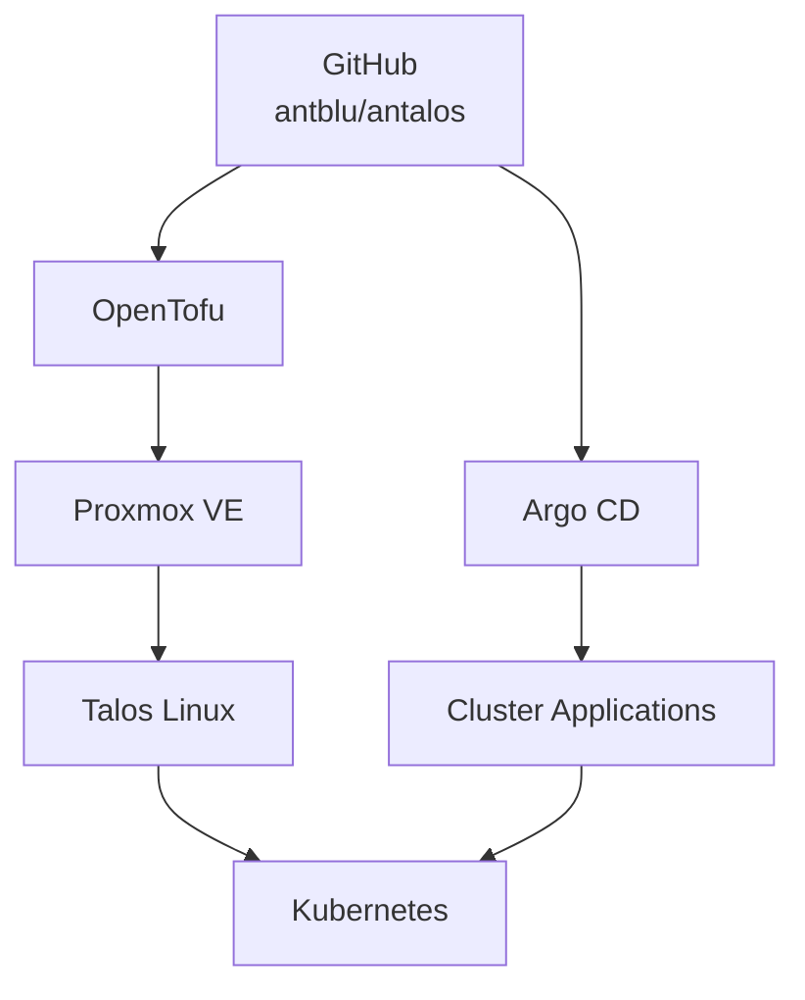
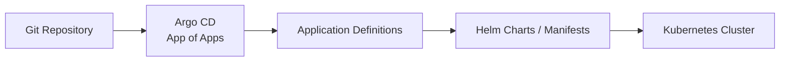

# Antalos

> Declarative infrastructure and GitOps source of truth for my Talos Kubernetes homelab.

[](https://github.com/proxmox)  [](https://github.com/siderolabs/talos)[](https://github.com/kubernetes/kubernetes)  [](https://github.com/traefik/traefik) [](https://github.com/cert-manager/cert-manager) [](https://github.com/bitnami-labs/sealed-secrets) [](https://github.com/metallb/metallb)[](https://github.com/openebs/openebs) [](https://github.com/cloudnative-pg/cloudnative-pg) [](https://github.com/postgres/postgres) [](https://github.com/redis/redis) [](https://github.com/redis/redis) [](https://github.com/elastic/elasticsearch) [](https://github.com/rancher/rancher)[](https://github.com/VictoriaMetrics/VictoriaMetrics)[](https://github.com/grafana/grafana) [](https://github.com/goauthentik/authentik)[](https://github.com/stalwartlabs/stalwart) [](https://github.com/antblu/antalos) [](https://github.com/antblu/antalos/commits/main) [](https://github.com/antblu/antalos/issues)[](https://github.com/antblu/antalos/stargazers)  

**Antalos** is the source of truth for my homelab Kubernetes infrastructure and applications.

The cluster runs **Talos Linux** on **Proxmox VE**, with the underlying virtual machines and Kubernetes bootstrap managed through **OpenTofu**. After the initial bootstrap, **Argo CD** continuously reconciles the cluster from this repository.

The goal is to keep as much of the environment as possible **declarative, reproducible, and recoverable from Git**.

---

## Architecture



The repository is divided into two main responsibilities:

1. **Infrastructure bootstrap** — OpenTofu creates the Talos VMs, bootstraps Kubernetes, and installs the initial Argo CD deployment.
    
2. **GitOps reconciliation** — Argo CD takes over steady-state management and continuously reconciles Kubernetes resources from Git.
    

---

## Stack as of 8/28/26

|Layer|Technology|Purpose|
|---|---|---|
|Hypervisor|**Proxmox VE**|Hosts the cluster virtual machines|
|Operating System|**Talos Linux**|Immutable Kubernetes-focused OS|
|Infrastructure as Code|**OpenTofu**|Provisions VMs and bootstraps the cluster|
|Container Orchestration|**Kubernetes**|Runs cluster workloads|
|GitOps|**Argo CD**|Reconciles cluster state from Git|
|Ingress|**Traefik**|HTTP/HTTPS ingress|
|Load Balancing|**MetalLB**|Bare-metal `LoadBalancer` services|
|Certificates|**cert-manager**|Automated TLS certificate management|
|Secrets|**Sealed Secrets**|Encrypted secrets stored safely in Git|
|Storage|**OpenEBS**|Local persistent storage|
|PostgreSQL|**CloudNativePG**|PostgreSQL lifecycle and replication|
|Authentication|**Authentik**|Identity provider and SSO|
|Management|**Rancher**|Kubernetes management interface|
|Monitoring|**VictoriaMetrics**|Metrics and observability|
|Mail|**Stalwart**|Mail services|

---

## Repository Structure

```text
antalos/
├── apps/
│   ├── <app-name>/
│   └── variables.yaml
│
├── docs/
│
├── infrastructure/
│   ├── argocd/
│   │   ├── app-of-apps.yaml
│   │   ├── argocd-self.yaml
│   │   └── default-project.yaml
│   │
│   ├── cert-manager/
│   ├── metallb/
│   │
│   └── opentofu/
│       ├── argotofu/
│       └── talostofu/
│
├── kubeconfig/
├── talosconfig/
|
├── LICENSE
└── README.md
```

### `apps/`

Contains the applications and Kubernetes resources managed by Argo CD.

Argo CD watches this part of the repository and reconciles the desired state into the cluster.

Shared externally managed values such as hostnames, load balancer addresses, and Talos node names are centralized in:

```text
apps/variables.yaml
```

These values are substituted into application manifests during rendering.

### `infrastructure/opentofu/talostofu/`

Creates the Talos virtual machines and bootstraps the Kubernetes cluster.

This layer handles infrastructure such as:

- Proxmox virtual machines
- Talos machine configuration
- control-plane nodes
- worker nodes
- node names and addressing
- Talos volumes
- Kubernetes bootstrap
- kubeconfig generation

### `infrastructure/opentofu/argotofu/`

Bootstraps Argo CD after Kubernetes is available.

OpenTofu performs only the initial installation needed to establish GitOps. Argo CD then manages its own steady-state configuration from Git.

### `infrastructure/argocd/`

Contains the root GitOps resources:

```text
argocd-self.yaml
app-of-apps.yaml
default-project.yaml
```

`argocd-self` acts as the recovery anchor for the cluster and allows Argo CD to reconcile its own configuration.

---

## GitOps Model

The cluster follows an **App of Apps** model.



Once the cluster is bootstrapped, normal changes are made through Git rather than by manually modifying Kubernetes resources.

Typical workflow:

```bash
git add .
git commit -m "Update cluster configuration"
git push
```

Argo CD detects the desired-state change and synchronizes the cluster.

---
## Fresh Cluster Bootstrap

### Check out [`deployment-order.md`](https://chatgpt.com/c/docs/deployment-guide/deployment-order.md)

---
## Secrets

Plaintext credentials are **not intended to be stored in this repository**.

Secrets are encrypted with **Bitnami Sealed Secrets**:

```text
Plaintext Secret
      │
      │ kubeseal
      ▼
SealedSecret
      │
      │ commit
      ▼
     Git
      │
      ▼
   Argo CD
      │
      ▼
Sealed Secrets Controller
      │
      ▼
Kubernetes Secret
```

The Sealed Secrets private key is backed up separately and restored during cluster recovery.

This allows the Kubernetes environment to be recreated from Git while still preserving access to encrypted application credentials.

See the full procedure:

[`k8s-secrets-bootstrap.md`](https://chatgpt.com/c/docs/deployment-guide/k8s-secrets-bootstrap.md)

---
## Applications

### Platform

**Argo CD**  
Provides GitOps reconciliation and manages the desired state of the cluster.

**Traefik**  
Provides ingress routing for HTTP and HTTPS workloads.

**MetalLB**  
Provides `LoadBalancer` addresses to services on the local network.

**cert-manager**  
Automates TLS certificate issuance and renewal.

**Sealed Secrets**  
Allows encrypted Kubernetes secrets to be safely committed to Git.

**OpenEBS**  
Provides persistent local storage to Kubernetes workloads.

### Services

**Authentik**  
Identity provider and authentication platform.

**CloudNativePG**  
Operates PostgreSQL clusters, including the database used by Authentik.

**Rancher**  
Provides a web-based Kubernetes management interface.

**Stalwart**  
Provides mail services.

**VictoriaMetrics**  
Provides monitoring and metrics storage.

---

## Using This Repository

This repository documents and manages **my specific homelab environment**. It is not intended to be a turnkey Kubernetes distribution.

If you use it as a reference or fork it for your own environment, expect to change at least:

- `apps/variables.yaml`
    
- `infrastructure/opentofu/talostofu/variables.tf`
    
- `infrastructure/certmanager/certificates.yaml`
- `infrastructure/certmanager/issuer.yaml`
    
- Replace all mentions of `https://github.com/antblu/antalos.git` with your own repo
	
- Make `infrastructure/opentofu/talostofu/terraform.tfvars` file with the following format
```yaml
proxmox_endpoint  = "https://10.20.0.6:8006/"
proxmox_api_token = "terraform@pam!provider=<api-token"
proxmox_insecure  = true
proxmox_ssh_username = "terraform"
proxmox_ssh_password = "<account-password"
```
>Ensure that the terraform account in Proxmox is pam, not pve. SSH access is required. Make sure API token privileges are permissive.
---

The architecture and GitOps patterns, however, are designed to be reusable.

---
### Trademarks

All product names, logos, and brands are property of their respective owners.
Use of these names and logos does not imply endorsement.
---
## License

This project is licensed under the [MIT License](https://chatgpt.com/c/LICENSE).