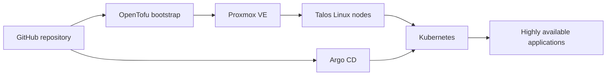

## Platform at a glance

Antalos is a highly available homelab Kubernetes platform. OpenTofu provisions Talos Linux virtual machines and bootstraps Kubernetes. Argo CD then continuously reconciles applications and supporting infrastructure from this repository.



## Control boundaries

| Layer | Owner | Responsibility |
| --- | --- | --- |
| Virtual infrastructure | OpenTofu | Proxmox VMs, Talos configuration, cluster bootstrap |
| Cluster desired state | Git and Argo CD | Application definitions, manifests, Helm values, and reconciliation |
| Edge traffic | MetalLB and Traefik | Load-balancer address, HTTP routing, and TLS termination |
| Certificates | cert-manager | ACME certificate issuance and renewal |
| Secrets | Sealed Secrets | Encrypted credentials that are safe to reconcile from Git |
| Persistent services | OpenEBS, CloudNativePG, NFS, and Garage S3 | Volumes, databases, shared application code, and object data |
| Observability | VictoriaMetrics and Grafana | Metrics collection, dashboards, and operational visibility |

## Repository map

```text
antalos/
├── apps/                     # Argo CD applications and Kubernetes manifests
│   └── variables.yaml        # Shared versions, hostnames, addresses, and sizes
├── docs/                     # Source Markdown for this site
├── infrastructure/
│   ├── argocd/               # Root app-of-apps resources
│   └── opentofu/             # Talos and Argo CD bootstrap stacks
└── site/                     # Astro Starlight and NGINX build definition
```

Normal application changes flow from GitHub to Argo CD. Direct cluster changes are reserved for bootstrap, recovery, or carefully documented break-glass operations.

## Where to begin

- New workstation: start with [workstation prerequisites](/deployment-guide/prerequisites/).
- New cluster: follow the [deployment order](/deployment-guide/deployment-order/).
- Healthy cluster: use the [routine operations runbook](/operations/routine-operations/).
- Failed cluster: begin with [disaster recovery](/recovery/disaster-recovery/).
