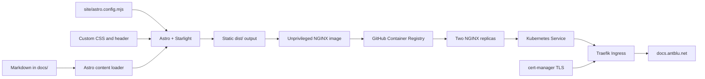

This documentation site is an [Astro](https://astro.build/) project using the [Starlight](https://starlight.astro.build/) documentation theme. Markdown remains in the repository-level `docs/` directory, while the framework, theme, container, and web-server configuration live in `site/`.

## Architecture

The site has separate authoring, build, delivery, and runtime layers:



| Layer | Location | Responsibility |
| --- | --- | --- |
| Content | `docs/**/*.md` | Pages, frontmatter, diagrams, and runbooks |
| Content bridge | `site/src/content.config.ts` | Loads repository-level Markdown into Starlight's `docs` collection |
| Site configuration | `site/astro.config.mjs` | Enables Starlight and configures navigation, search, metadata, and component overrides |
| Presentation | `site/src/styles/antalos.css` | Light and dark color tokens, typography, spacing, and component styling |
| Header branding | `site/src/components/Header.astro` | Extends Starlight's header and renders `logoantalos.png` |
| Static build | `site/package.json` | Runs Astro validation and generates `site/dist/` |
| Container | `site/Dockerfile`, `site/nginx.conf` | Builds the static output and serves it from unprivileged NGINX on port 8080 |
| Image automation | `.github/workflows/docs-image.yaml` | Builds pull requests and publishes `main` and commit-SHA tags to GHCR |
| Runtime | `apps/docs/` | Reconciles two NGINX replicas, a Service, Traefik Ingress, disruption budget, and TLS certificate |

The deployment uses required pod anti-affinity on `kubernetes.io/hostname`, so the two replicas must run on different nodes. A `PodDisruptionBudget` keeps at least one replica available during voluntary disruption.

## Build locally

Install a current Node.js release compatible with the version in `apps/variables.yaml` and install pnpm 11. From the repository root:

```bash
cd site
pnpm install --frozen-lockfile
pnpm dev
```

Astro prints the local development URL, normally `http://localhost:4321`. The development server watches both the `site/` project and Markdown loaded from `../docs`.

Before proposing a change, run the same validation used by the container build:

```bash
cd site
pnpm run build
pnpm preview
```

`pnpm run build` runs `astro check` first and then writes the static website to `site/dist/`. The `dist/` directory is generated output and should not be committed.

## Add or edit a page

Create Markdown beneath `docs/`. Its directory becomes part of the public URL. For example, this source file:

```text
docs/site/build-and-customize.md
```

is published at:

```text
/site/build-and-customize/
```

Every page should begin with Starlight frontmatter:

```yaml
---
title: Page title
description: A concise summary used by the page and search metadata.
sidebar:
  order: 2
---
```

The sidebar groups in `site/astro.config.mjs` autogenerate their page links from matching directories. Add a new group there only when introducing a new top-level documentation section.

## Change the color scheme

The site supports dark and light modes. Make palette changes in `site/src/styles/antalos.css` instead of editing generated Starlight CSS.

Dark-mode defaults are declared in `:root`:

```css
:root {
  --antalos-blue: #3488ff;
  --antalos-cyan: #57d8ff;
  --sl-color-accent: var(--antalos-blue-bright);
  --sl-color-bg: #070d16;
  --sl-color-bg-sidebar: #080f19;
}
```

Light-mode overrides are scoped to the theme attribute:

```css
:root[data-theme='light'] {
  --sl-color-accent: #0866d8;
  --sl-color-bg: #ffffff;
  --sl-color-bg-sidebar: #f8fafc;
}
```

When changing the palette:

1. Update both dark and light values.
2. Preserve readable contrast for text, links, borders, and inline code.
3. Reuse semantic Starlight variables such as `--sl-color-accent` and `--sl-color-bg` throughout component rules.
4. Run `pnpm dev` and inspect ordinary pages, code blocks, tables, the sidebar, and the theme switcher in both modes.
5. Finish with `pnpm run build`.

Layout tokens such as `--sl-nav-height`, `--sl-sidebar-width`, and `--sl-content-width` are also defined near the top of the stylesheet. Component-specific rules follow the tokens, making broad changes easier to review.

## Adjust the header and logo

Starlight supports component overrides through its `components` configuration. This site maps the framework's `Header` component to `site/src/components/Header.astro`, which replaces Starlight's default title treatment with the Antalos logo at the top left while retaining search, social links, and the two-state theme button.

To replace the logo, overwrite `site/src/logoantalos.png` with a transparent PNG and keep a wide aspect ratio. The component constrains its rendered height, so a high-resolution source remains sharp without changing the navigation height.

## Build the container

The multi-stage Dockerfile requires the Node and NGINX base-image tags stored in `apps/variables.yaml`:

```bash
docker build \
  --build-arg NODE_IMAGE_TAG=24.8.0-alpine3.22 \
  --build-arg NGINX_IMAGE_TAG=1.29.8-alpine \
  --tag antalos-docs:local \
  --file site/Dockerfile \
  .

docker run --rm --publish 8080:8080 antalos-docs:local
```

Open `http://localhost:8080` and verify `http://localhost:8080/healthz` returns `ok`.

When image versions change, update the corresponding `DOCS_*` entries in `apps/variables.yaml`. Keep application versions and hostnames there rather than hardcoding new values in Kubernetes manifests.

## Publish and deploy

A pull request that changes `docs/`, `site/`, the workflow, or shared variables performs a container build without publishing it. After the change reaches `main`, GitHub Actions publishes:

- `ghcr.io/antblu/antalos-docs:main`
- `ghcr.io/antblu/antalos-docs:sha-<commit>`

Argo CD reconciles `apps/docs/` and substitutes `${DOCS_HOST}` and `${DOCS_IMAGE_TAG}` from `apps/variables.yaml`. Kubernetes pulls the selected GHCR image, rolls both replicas without planned downtime, and exposes them through Traefik at `https://docs.antblu.net`. cert-manager stores the site's certificate in the `docs-tls` Secret.

For an immutable deployment, change `DOCS_IMAGE_TAG` from `main` to the desired `sha-<commit>` tag after GitHub Actions publishes it. Then let Argo CD reconcile the Git change.

## Change checklist

- Keep documentation source in `docs/` and site implementation in `site/`.
- Preserve Starlight's content schema and component APIs.
- Test dark and light modes after changing visual tokens.
- Run `pnpm run build` before pushing.
- Build from the repository root when testing the Docker image.
- Keep image tags, hostnames, and versions in `apps/variables.yaml`.
- Never commit `site/node_modules/` or `site/dist/`.
